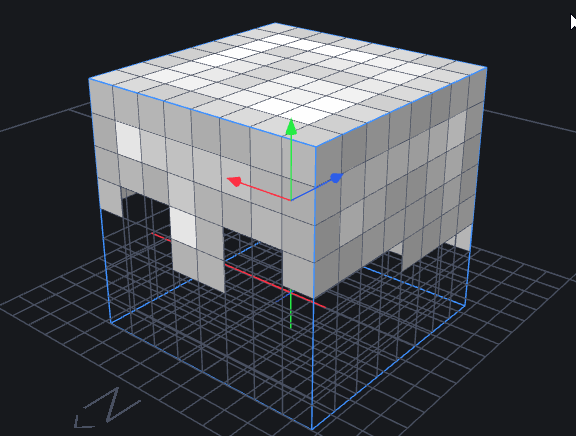
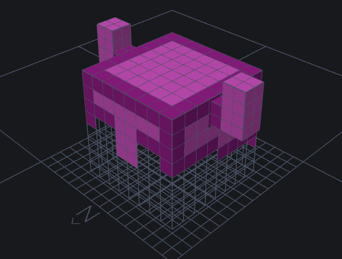
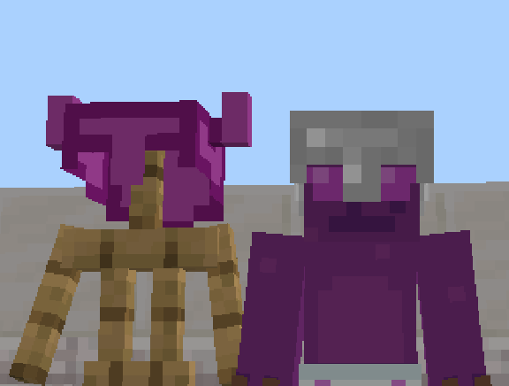
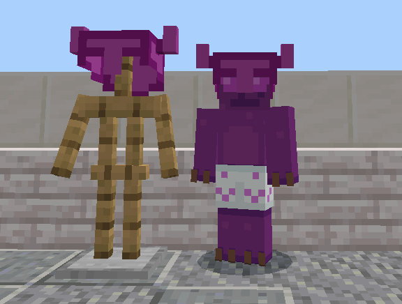
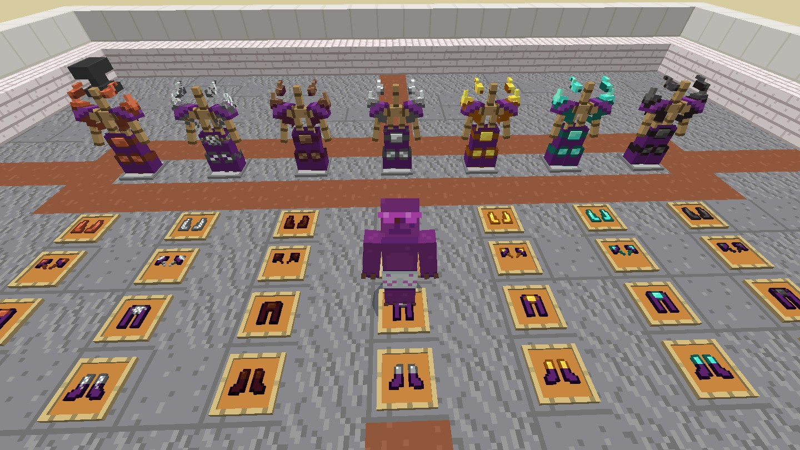

# Como cambiar el modelo de geometría.json MC-Bedrock

> En este mismo repo en la carpeta `demo` esta el paquete de recurso de ejemplo

## 1. Crear Modelo

> IMPORTANTE <br>
> Este modelaje fue en hecho con el editor 3D [Blockchench](https://www.blockbench.net/)

Tomaremos el modelo del Casco de hierro por su simplicidad de
ser unicamente un Cubo.  



Agregando unos sencillos cuerno como ejemplo, 




Al terminal el modelo y Guarda en el BlockBenchs nos da dos Archivo 

> podes poner el nombre que quieras pero se recomienda usar 
> usar los mismo nombre del tutorial para evitar 
> confusiones 

```
iron_hermet_example.geo.json
texture_iron_hermet_example.png

```

esto lo que utilizaremos para sobre ajuntar al casco de hierro default de Minecraft 

## 2. Estructura De archivos  

Abrimos el explorador de archivos vamos a esta rutas 
`%localappdata%\Packages\Microsoft.MinecraftUWP_8wekyb3d8bbwe\LocalState\games\com.mojang`
aquí se guarda los datos referente del juegos, estando ahi 
entramos a la carpeta `development_resource_packs` aqui creamos 
esta estructura de carpeta 

> copiamos los archivo que obtuvimos antes con blockbenchs

```
My_custom_texture
    \- attachables
    \- models
    \   \- entity
    \       \- attachable
    \           \- iron_hermet_example.geo.json
    \
    \-texture 
        \- entity
            \- attachable
                \- texture_iron_hermet_example.png
```

## 3. creamos los archivo attachables

> los archivo attachable son los archivo que adjunta 
> los distinto modelos con las textura, animaciones, script 
> etc... 
> para el ejemplo solo ajuntaremos los el modelo y la textura que 
> hicimos antes al item de `casco de hierro`

entramos en la carpeta `My_custom_texture\attachables\`,
creamos el archivo `iron_helmet.attachable.json` y 
copiamos el contenido

```json
// iron_helmet.attachable.json
{
	"format_version": "1.10.0",
	"minecraft:attachable": {
		"description": {
			"identifier": "minecraft:iron_helmet",
			"render_controllers": ["controller.render.armor"],
			"materials": {
				"default": "entity_alphatest",
				"enchanted": "entity_alphatest_glint"
			},
			"textures": {
				"default": "textures/entity/attachable/texture_iron_hermet_example.png",
				"enchanted": "textures/misc/enchanted_item_glint"
			},
			"geometry": {
				"default": "geometry.iron_hermet_example.geo.json"
			}
		}
	}
}
```

los parámetros importante son el 

- `indetifier` -> es cual es la entidad cual tenemos queremos adjuntar los parámetros ***[MinecraftItemIds.com](https://minecraftitemids.com/)***
- `texture.default` -> ruta de la textura del modelo 
- `geometry.default` -> el modelo geométrico que tomara la entidad 

---

Con esto tendríamos este resultado 



esto es debido que la armadura en especifico tiene
un parámetros en especifico que muestra distinto modelos 
para estar en el *soporte de armadura* y cuando esta en el 
jugador  

para solucionar esto hay que crear otro archivo attachable
ara el modelo de la armadura sobre el jugador. 

creamos el `iron_helmet.attachable.json` en la carpeta en la `My_custom_texture\attachables`

con el siguiente contenido 

```json
// iron_helmet_plaer.attachable.json
{
	"format_version": "1.10.0",
	"minecraft:attachable": {
		"description": {
			"identifier": "minecraft:iron_helmet.player",
			"render_controllers": ["controller.render.armor"],
			"materials": {
				"default": "entity_alphatest",
				"enchanted": "entity_alphatest_glint"
			},
			"textures": {
				"default": "textures/entity/attachable/texture_iron_hermet_example.png",
				"enchanted": "textures/misc/enchanted_item_glint"
			},
			"geometry": {
				"default": "geometry.iron_hermet_example.geo.json"
			}
		}
	}
}
```

resalta el `indetifier` cambio a 
```json
//...
"description": {
	"identifier": "minecraft:iron_helmet.player",
//...
```



--- 

Listo ya tendriamos las base para cambiar la geomtria y textura de los elementos del juegos solo abria que repetir este prosesco con cada elemento que quisieramos cambiar. 



---

## referencia 
[bedrock attachable](https://wiki.bedrock.dev/items/high-resolution-items)
[Custom armor](https://wiki.bedrock.dev/items/custom-armor)